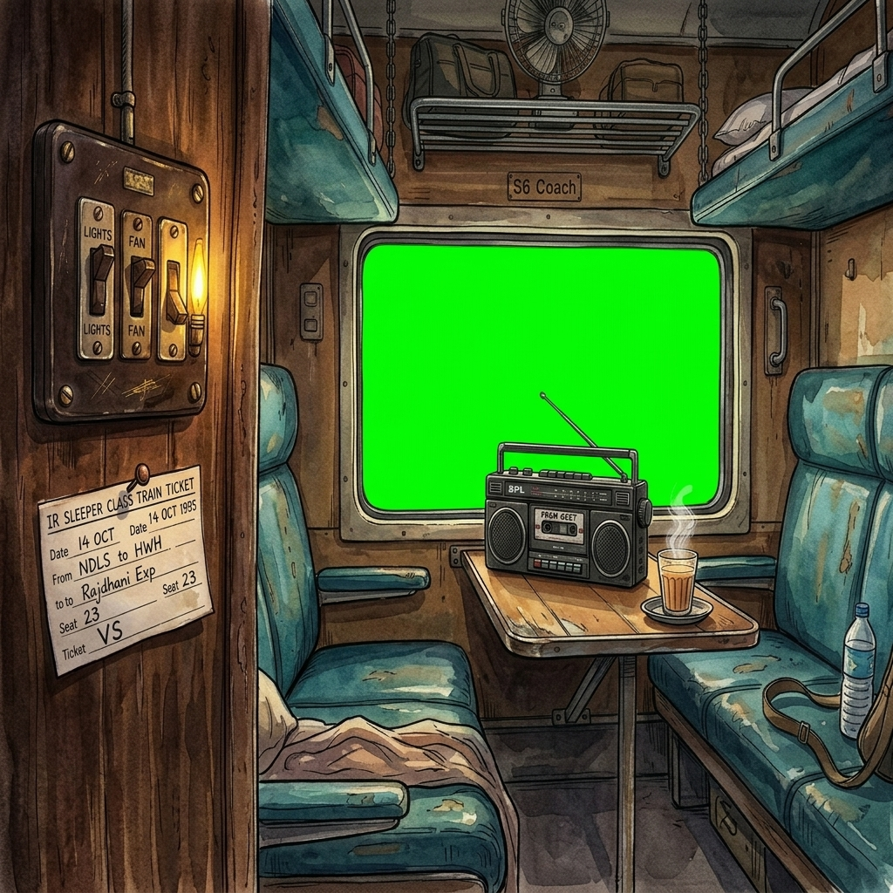
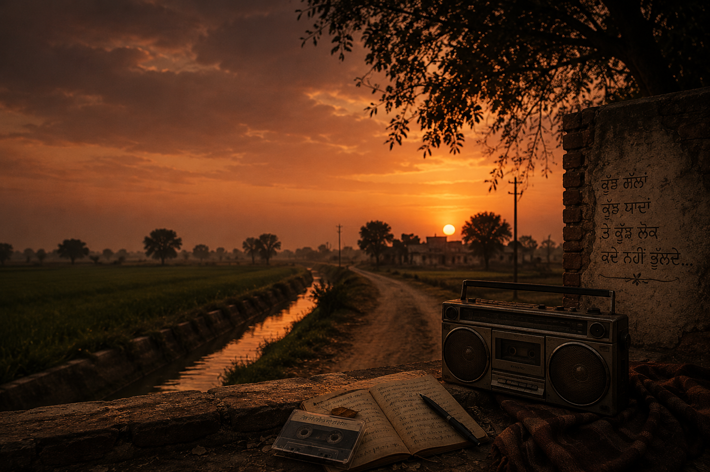
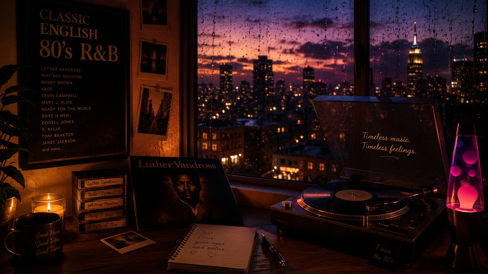

# 🚂 Sleeper Coach Playlist — Window Seat Experience

<p align="center">
  
  
  
</p>

<p align="center">
  
  
  
  
  
</p>

<p align="center">
  
</p>

> An immersive, interactive, and retro musical journey across regional India. Take the window seat, slide down the shutter, sip a hot ginger chai, and let the rhythmic train sounds carry you away.

🌐 **[Experience the Live Journey →](https://sleeper-coach-playlist.vercel.app)**

---

## 📷 Theme Gallery & Cabin Preview

Explore the beautiful visual layouts custom-designed for each theme:

<table>
  <tr>
    <td width="50%">
      <p align="center"><b>🚂 Classic Train (Hindi Retro)</b></p>
      
    </td>
    <td width="50%">
      <p align="center"><b>🌾 Sad Punjabi (Sufi Folk)</b></p>
      
    </td>
  </tr>
  <tr>
    <td width="50%">
      <p align="center"><b>🏔️ Jammu Dogri (Valley Folk)</b></p>
      
    </td>
    <td width="50%">
      <p align="center"><b>🎵 80's English R&B (Cozy Rain)</b></p>
      
    </td>
  </tr>
</table>

---

## 📖 The Concept
Inspired by long overnight train journeys in Indian Railways sleeper coaches, this application combines **ambient sound layering, interactive HTML5 controls, and curated regional soundtracks** to recreate the cozy, nostalgic feeling of traveling by train.

---

## 🎨 Interactive Vibes (Themes)

You can choose your companion soundtrack and visual layout for the journey:

| Vibe | Icon | Language | Soundtrack Profile | Tab Icon |
| :--- | :---: | :--- | :--- | :---: |
| **Classic Train** | 🚂 | Hindi Retro | Nostalgic golden classics, ambient sleeper coach sounds. | 🚂 |
| **Sad Punjabi** | 🌾 | Punjabi Folk | Deep Sufi folk and melancholy acoustic tracks. | 🌾 |
| **Jammu Dogri** | 🏔️ | Dogri Folk | Valley folk melodies, mountain breeze, and regional Jammu playlist. | 🏔️ |
| **80's English R&B** | 🎵 | English Retro | Timeless R&B hits, cozy city rain vibe, and retro cassette deck. | 🎵 |

---

## 🎛️ Interactive Controls (BERTH CONSOLE)

You are in full command of the passenger berth experience. Open the **Console Deck** to control:
*   💡 **Cabin Lights:** Switch the lights `ON/OFF` to toggle the ambient day/night shaders.
*   💨 **Cabin Fan:** Turn the vintage fan on to spin the blades and hear the retro hum.
*   🌧️ **Rain Shader:** Toggle window rain effects to wash over the scenery.
*   🔊 **Berth Soundboard:** Layer background ambient audios (track rumble, rain patter, station announcement, wind) to craft your perfect acoustic space.
*   🚨 **Emergency Pull Chain:** Pull the safety chain to trigger the brake warning alarm.
*   ☕ **Chai Hotspot:** Click the cutting chai glass to take a sip of hot ginger tea.

---

## 📂 Version Release Archive

Explore the progression of this project inside the [`/releases`](releases) folder:

*   📁 **[`releases/v1.0-classic-train`](releases/v1.0-classic-train)**
    *   *The Beginning:* The core Classic Train theme featuring the base sleeper compartment visualizer and HTML5 audio player.
*   📁 **[`releases/v2.0-multi-theme`](releases/v2.0-multi-theme)**
    *   *The Expansion:* Introduced Punjab, Jammu (Dogri), and English themes with tailored graphics, background quotes, and customized playlists.
*   📁 **[`releases/v3.0-mobile-interactive`](releases/v3.0-mobile-interactive)**
    *   *The Polish:* Added the live interactive glass selector welcome screen, favicons for browser tabs, dynamic scrollable control panels, and mobile responsive optimization.

---

## 🚀 Run it Locally

1.  Clone this repository:
    ```bash
    git clone https://github.com/dev-vasu/sleeper-coach-playlist.git
    ```
2.  Open the latest release folder:
    ```bash
    cd sleeper-coach-playlist/releases/v3.0-mobile-interactive
    ```
3.  Open `index.html` in your favorite web browser!

---

> [!TIP]
> **Best experienced on Laptop/PC** with headphones on for full binaural ambient audio layering! 🎧
